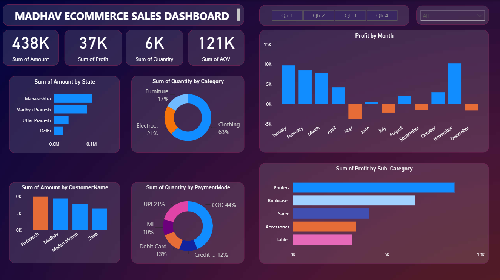

# Madhav Ecommerce Sales Analysis – Power BI
## 📊 Project Overview
This project is an interactive **Ecommerce Sales Dashboard** developed using **Microsoft Power BI**.
The dashboard analyzes ecommerce sales performance across different states, categories, customers, payment methods, months, and product sub-categories.
The goal of this project is to identify important sales and profitability trends and present them through an easy-to-understand interactive dashboard.
## 🛠️ Tools & Technologies
* Microsoft Power BI
* Power Query
* DAX
* Microsoft Excel / CSV
* Data Visualization
* Data Cleaning & Transformation
## 📈 Dashboard Features
The dashboard provides insights into:
* Total Sales Amount
* Total Profit
* Total Quantity Sold
* Average Order Value (AOV)
* Sales by State
* Quantity by Category
* Profit by Month
* Sales by Customer
* Quantity by Payment Mode
* Profit by Sub-Category
* Quarterly and category-level filtering
## 🔍 Key Insights
Some of the major insights available from the dashboard include:
* Clothing contributes the largest share of quantity among the displayed categories.
* Maharashtra has the highest sales amount among the displayed states.
* Printers generate the highest profit among the displayed sub-categories.
* COD is the largest payment mode by quantity.
* Monthly profit varies significantly throughout the year, with some months showing negative profit.
## 🖥️ Dashboard Preview

## 🎯 Project Objective
The objective of this project is to demonstrate practical skills in:
* Data cleaning
* Data transformation
* Data modeling
* DAX calculations
* Data visualization
* Business intelligence
* Interactive dashboard development
* Extracting actionable insights from sales data
## 👨‍💻 Author
Sahil Rawat

BCA Graduate | Aspiring Data Analyst

Skills: Python | SQL | Power BI | Excel | Data Analysis
---
⭐ If you find this project useful, feel free to star the repository.

